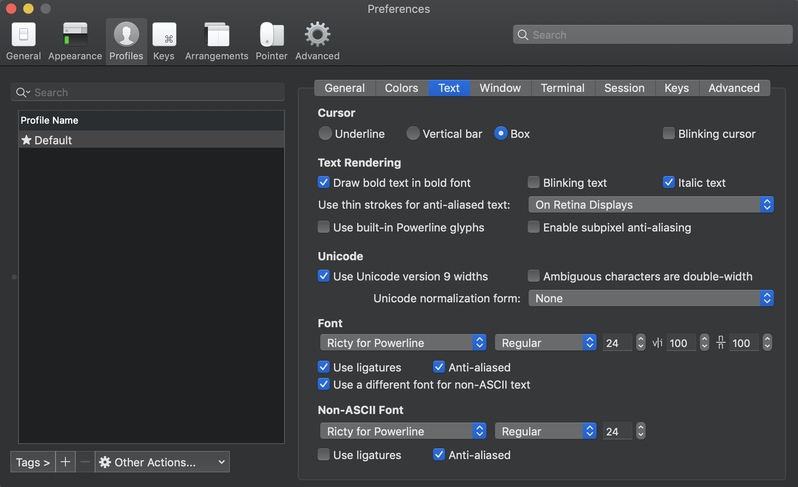

# dotfiles
## 構成
- zsh & zplug
- neovim & vim-plug

## zplug install

```sh
curl -sL --proto-redir -all,https https://raw.githubusercontent.com/zplug/installer/master/installer.zsh| zsh
```

## vim-plug install

```sh
curl -fLo ~/.vim/autoload/plug.vim --create-dirs \
    https://raw.githubusercontent.com/junegunn/vim-plug/master/plug.vim
```

## シンボリックリンクの作成
### zshell

```sh
cd symlink_settings && sh make_zsh_symlinks
```

### neovim

```sh
cd symlink_settings && sh make_vim_symlinks
```

### 両方

```sh
cd symlink_settings && sh make_all_symlinks
```

## Neovim setting
### Neovim install

```sh
brew install neovim
```

### Deoplete用の設定
pyenvを入れると、pipもついてくるので、pipでpynvimとneovimを入れる必要がある

```sh
pip install pynvim
pip install neovim
```

### Ricty for powerline(neovimの表示用)
#### Step 1
```
brew tap sanemat/font
brew install ricty --with-powerline
cp -f /usr/local/opt/ricty/share/fonts/Ricty*.ttf ~/Library/Fonts/
fc-cache -vf
```

#### Step 2
iTerm側でfontの設定が必要。これと同じように設定する


## Markdown Preview Plus
`chrome://extensions`にいって、詳細をクリック後にファイルのURLへのアクセスを許可するをクリックする

## Nodenv and yarn installation

```sh
anyenv install nodenv
nodenv install -l
nodenv install (versionは自分で調べてから入れる)
touch $(nodenv root)/default-packages
mkdir -p "$(nodenv root)/plugins"
git clone https://github.com/pine/nodenv-yarn-install.git "$(nodenv root)/plugins/nodenv-yarn-install" //yarn
nodenv uninstall (最初に選んだversion)
nodenv install (最初に選んだversion)
yarn add global tern
```

## karabiner element
Add ruleからのimport more rules from the internetで日本語入力時のesc(vim)を入れる
