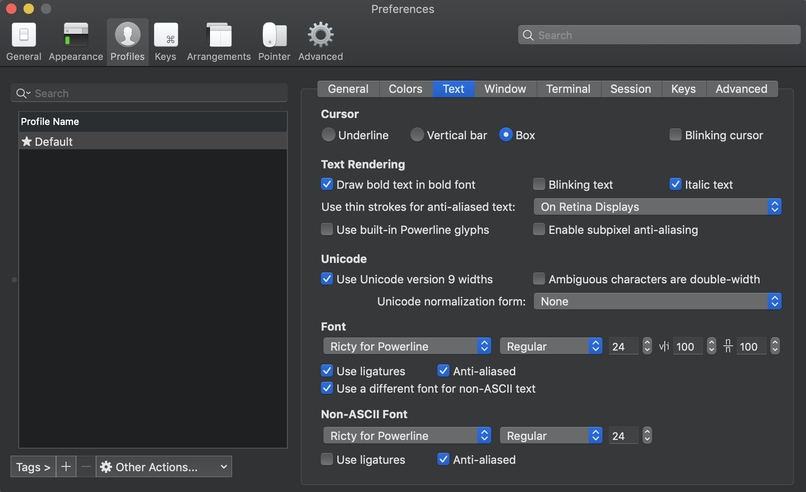

# dotfiles
## 構成
- zsh & zplug
- neovim & vim-plug

## zplug install
```
curl -sL --proto-redir -all,https https://raw.githubusercontent.com/zplug/installer/master/installer.zsh| zsh
```

## vim-plug install
```
curl -fLo ~/.vim/autoload/plug.vim --create-dirs \
    https://raw.githubusercontent.com/junegunn/vim-plug/master/plug.vim
```

## シンボリックリンクの作成
### zshell
```
sh makeZshSymLinks.sh
```

### neovim
```
sh makeVimSymLinks.sh
```

### 両方
```
sh makeVimSymLinks.sh
```

## Neovim setting
### Neovim install
```
brew install neovim
```
### Deoplete用の設定
pyenvを入れると、pipもついてくるので、pipでpynvimとneovimを入れる必要がある
```
pip install pynvim
pip install neovim
```

### Ricty for powerline(neovimの表示用)
#### Step 1
```
brew tap sanemat/font
brew install ricty --with-powerline
cp -f /usr/local/opt/ricty/share/fonts/Ricty*.ttf ~/Library/Fonts/
fc-cache -vf
```

#### Step 2 
iTerm側でfontの設定が必要。これと同じように設定する  


## Markdown Preview Plus
`chrome://extensions`にいって、詳細をクリック後にファイルのURLへのアクセスを許可するをクリックする

## Nodenv and yarn installation
```
anyenv install nodenv
nodenv install -l
nodenv install (versionは自分で調べてから入れる)
touch $(nodenv root)/default-packages
mkdir -p "$(nodenv root)/plugins"
git clone https://github.com/pine/nodenv-yarn-install.git "$(nodenv root)/plugins/nodenv-yarn-install" //yarn
nodenv uninstall (最初に選んだversion)
nodenv install (最初に選んだversion)
```

## TODO
- [ ] brewtap、brewcask等で必要な物を一括でインストールできるようにする
- [ ] それぞれのファイルの役割をREADMEに書く
- [ ] init.vimの中の必要のないものを削除して、ショートカット用のファイル(shortcuts.vimとか)を切り出す
- [x] zshrcの中の必要のないものを削除して、環境依存のものと共通なものを切り分ける
- [x] ricty for powerlineを追加する
- [x] symlinkを貼るだけでnvimが動くようにする(makeVimSymLinks.shの改善)
- [x] aliasesでPC名になっているところをwhoamiに置き換える
- [x] aliasをlocal依存のものと分割する
